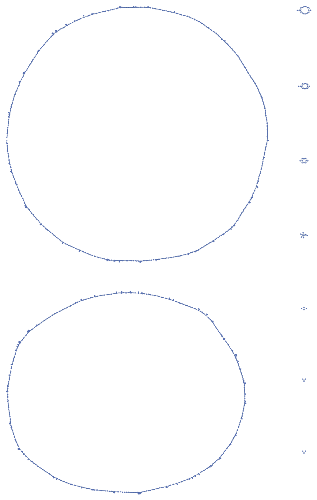

This code runs the [Mapper](https://research.math.osu.edu/tgda/mapperPBG.pdf) algorithm, developed by Gurjeet Singh, Facundo Mémoli, and Gunnar Carlsson, on a knot being rendered in Rob Scharein's software [KnotPlot](https://www.knotplot.com/).

The code uses projection to the $x$-coordinate of the underlying "beads" in KnotPlot as the filter function, and clusters via connected components. You can specify how subintervals to use, as well as the percent overlap between adjacent bins.

usage: buy Knotplot. download this code. put it in KnotPlot, then load your favorite knot or link. run the following command:

`lua run knotmapper/knotmapper.lua [number of bins] [percent overlap]`

You'll get a [graph6](https://users.cecs.anu.edu.au/~bdm/data/formats.txt) representation of the resulting graph. Try using Mathematica to decode it while I write something in Lua to do it.

Examples:

Example knot generated using the `celtic lua` demo in KnotPlot.

Mapper output using 15 bins with 15% overlap, rendered with Mathematica. Note the graph has nine connected components and the knot has 9 strands.

Mapper output using 15 bins with 75% overlap, also rendered with Mathematica. A little noisier, but kind of vaguely the same.